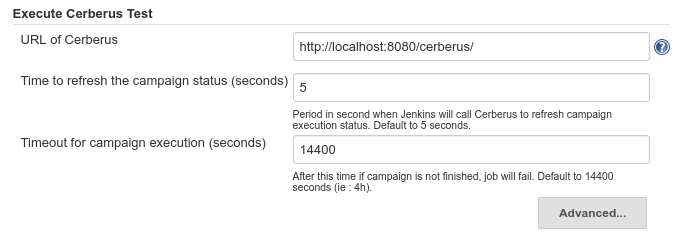
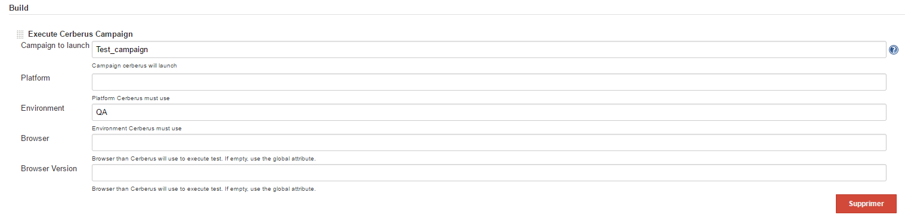
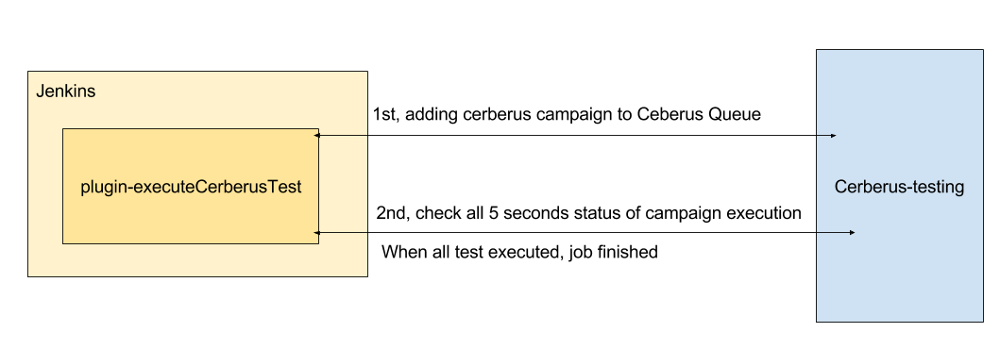

# Cerberus Jenkins Plugin

This plugin allows : 
* To launch a test campaign on Cerberus
* To wait Cerberus executes it
* To display a report on console. Fail if a test is ko, else sucess.

## What is cerberus ?
Cerberus is an open source, user friendly, **automated testing sofware**. See [website](https://www.cerberus-testing.org) for more information


## Get started
* Install plugin on Jenkins
* Set parameters on "Manage Jenkins" screen : 


### On Jenkins
* To add a campaign Cerberus execution on a job, add a new build step "Execute Cerberus Campaign", and set parameters :

 

### On Jenkinsfile
* Just call `executeCerberusCampaigne` function with parameters :
	* `campaignName` : Campaign name to execute
	* `platform` :  Platform to execute (define into Cerberus)
	* `environment` :  Environment to execute (define into Cerberus)
	* `browser` : Browser executed by Cerberus to test application. If `browser` is empty, use global settings of Cerberus plugin.
	* `browserVersion` :  Browser version executed by Cerberus to test application. If `browserVersion` is empty, use global settings of Cerberus plugin.
   
```
pipeline {	
   ...
    stages {
		...
		stage('cerberus Test') {
			steps {					
				executeCerberusCampaign campaignName : "Test_campaign" , platform : "", environment : "QA", browser : "firefox", browserVersion : "47"
			}
		}		
		...
	}
}
```

## Run plugin on localhost
For more detail on how develop a plugin for Jenkins, see [here](https://wiki.jenkins-ci.org/display/JENKINS/Plugin+tutorial).

NetBeans 6.7+ users can just hit Debug. For all others, run the following command to launch Jenkins with your plugin:
Convenient:
```
mvnDebug hpi:run
```

Unix:
```
$ export MAVEN_OPTS="-Xdebug -Xrunjdwp:transport=dt_socket,server=y,address=8000,suspend=n"
$ mvn package hpi:run
```

Windows:

```
> set MAVEN_OPTS=-Xdebug -Xrunjdwp:transport=dt_socket,server=y,address=8000,suspend=n
> mvn package hpi:run
```

If you open http://localhost:8080/jenkins in your browser, you should see the Jenkins page running in Jetty. The MAVEN_OPTS portion launches this whole thing with the debugger port 8000, so you should be able to start a debug session to this port from your IDE.

Once this starts running, keep it running. Jetty will pick up all the changes automatically.

When you make changes to view files in `src/main/resources` or resource files in `src/main/webapp`, just hit `F5` in your browser to see the changes.

When you change Java source files, compile them in your IDE and Jetty should automatically redeploy Jenkins to pick up those changes. There is no need to run mvn at all.

`MAVEN_OPTS` can be used to specify all sorts of other JVM parameters, like -Xmx


#### Import project into Eclispe

```
$ mvn -DdownloadSources=true -DdownloadJavadocs=true -DoutputDirectory=target/eclipse-classes -Declipse.workspace=<workspace_path> eclipse:eclipse eclipse:configure-workspace	
```


## Technical Architecture
### Principle


### Code
`ExecuteCerberusCampaign` is the main class call by Jenkins. 
It use :
* `ExecuteCampaign` who add Cerberus campaign to Ceberus Queue.
```java
executeCampaign.execute();
```

* `CheckCampaignStatus` who check all 5 seconds status of campaign execution. When all test executed, job is finished
```java
checkCampaignStatus.execute(resultDto -> {	  
	// display advancement
	logger.println("Advancement : " + resultDto.getPercentOfTestExecuted() + "%");
}, resultDto -> {
 	// display result and shutdown
	logger.println("Result : " + resultDto.getResult() + "); 
});
```

`ExecuteCampaign` and `CheckCampaignStatus` are independent and could be used by other process than Jenkins.


## License

Cerberus Copyright (C) 2013 - 2017 cerberustesting

This file is part of Cerberus.

Cerberus is free software: you can redistribute it and/or modify
it under the terms of the GNU General Public License as published by
the Free Software Foundation, either version 3 of the License, or
(at your option) any later version.

Cerberus is distributed in the hope that it will be useful,
but WITHOUT ANY WARRANTY; without even the implied warranty of
MERCHANTABILITY or FITNESS FOR A PARTICULAR PURPOSE.  See the
GNU General Public License for more details.

You should have received a copy of the GNU General Public License
along with Cerberus.  If not, see <http://www.gnu.org/licenses/>.